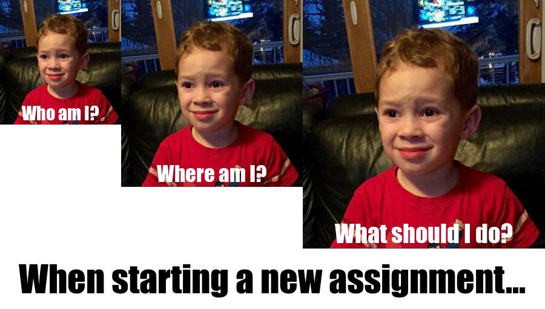

# About my meme



_I used R code and the .[{magick}](https://cran.r-project.org/web/packages/magick/vignettes/intro.html) package to create the meme_

## Motivation

* Part A of the Assigmnent 1 I need to do for my STATS 220 course.
* I was very confused at the beginning of the assignment so I decided to create a meme to show how I was feeling at the time.

## Adaption
1. When I was looking through various memes online to find inspiration for the format, I found a format where an identical image appears three times in order of size (some examples: ).
2. The image I wanted to use at first was the .[Confused Nick Young](https://i.kym-cdn.com/entries/icons/mobile/000/018/489/nick-young-confused-face-300x256-nqlyaa.jpg), but in the process of finding the original image I found the .[Sarcastic Laughing Kid](https://me.me/market?s=pop), which I thought would be more interesting.

```r
library(magick)

face <- image_read("https://amuletopublicidade.com.br/wp-content/uploads/2019/12/img-737631-gavin-mastodon20160913141473788865.jpg")

# small
small <- image_scale(face, 200) %>%
  image_annotate(text = "Who am I?", color = "#ffffff", size = 30, font = "Impact", gravity = "south")

#medium
medium <- image_scale(face, 300) %>%
  image_annotate(text = "Where am I?", color = "#ffffff", size = 35, font = "Impact", gravity = "south")

#large
large <- image_scale(face, 400) %>%
  image_annotate(text = "What should I do?", color = "#ffffff", size = 40, font = "Impact", gravity = "south")

#text
text <- image_blank(width = 900, height = 100, color = "#ffffff") %>%
  image_annotate(text = "When starting a new assignment...", color = "#000000", size = 60, font = "Impact", gravity = "center")

# faces
faces <- c(small, medium, large) %>%
  image_append()

#making the whole thing
meme <- c(faces, text) %>%
  image_append(stack = TRUE)

image_write(meme, "my_meme.png")
```
_The R code I used to create the meme_
